<h1 align="start">Hola, soy Víctor Manuel Ordiales García</h1>
<h3 align="start">Software Engineer · Lead Developer</h3>

  
  
  
  

## 👨‍💻 Sobre mí

Software Engineer con 4+ años de experiencia construyendo aplicaciones web empresariales. TypeScript y Java como lenguajes principales, con foco en arquitectura de sistemas que escalan y se mantienen bien. Background en Física — pensamiento analítico aplicado al software.

Actualmente trabajo como Lead Developer en **Alvea S.A**, donde desarrollo portales de alto tráfico con OWCS, Spring Framework y JavaScript/TypeScript.

## 🚀 Proyecto destacado

### [veriel.dev](https://veriel.dev) — Portfolio personal

Portfolio minimalista con tipografía outline, tema oscuro y animaciones fluidas. Diseñado como un escaparate profesional con navegación por scroll-snap.

**Stack:** React 19 · TypeScript · Vite 8 · Tailwind CSS 4 · Motion · Wouter

**Características:**
- Secciones con scroll-snap: Hero, About, Stack, Proyectos, Experiencia, Contacto
- Página de proyectos con filtros por categoría y detalle individual
- CV descargable
- SEO gestionado con React Helmet

> Repo: [web-minimalista](https://github.com/veriel-dev/web-minimalista)

## 🛠️ Lenguajes y Herramientas

  
  
  
  
  
  
  
  
  
  
  
  
  
  
  
  
  
  
  
  

## 📊 Estadísticas de GitHub

  

  

---

veriel.dev
